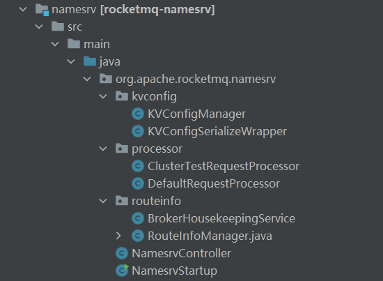
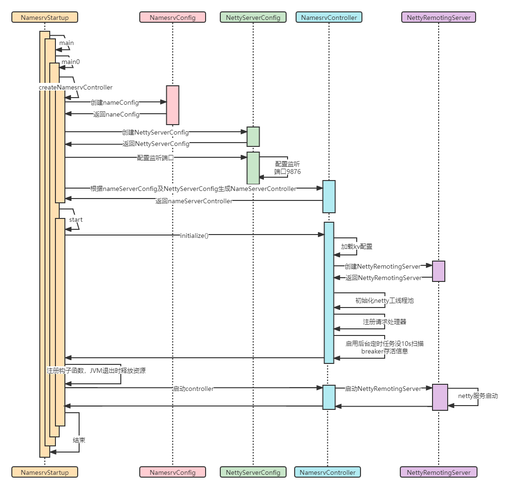

# rocketmq源码阅读与分析
## 一、nameServer源码
### 1.代码结构

nameServer的代码结构比较简单（之前依赖zooKeeper，现在通过分轻量级的nameServer替代zooKeeper的角色）。
- kvConfig
该包下类的主要功能用于管理zk配置的一些信息，包括配置加载、配置新增、配置删除等操作，通过juc锁及hashMap实现。
- processor
请求处理器，是nameServer接受处理各类请求。主要包括KvConfig相关、broker相关、topic相关等处理请求。
```java
    switch (request.getCode()) {
        /**
         * KVConfig相关操作
         */
        case RequestCode.PUT_KV_CONFIG:
            return this.putKVConfig(ctx, request);
        case RequestCode.GET_KV_CONFIG:
            return this.getKVConfig(ctx, request);
        case RequestCode.DELETE_KV_CONFIG:
            return this.deleteKVConfig(ctx, request);
        case RequestCode.QUERY_DATA_VERSION:
            return queryBrokerTopicConfig(ctx, request);
        /**
         * broker相关操作
         */
        case RequestCode.REGISTER_BROKER:
            Version brokerVersion = MQVersion.value2Version(request.getVersion());
            if (brokerVersion.ordinal() >= MQVersion.Version.V3_0_11.ordinal()) {
                return this.registerBrokerWithFilterServer(ctx, request);
            } else {
                return this.registerBroker(ctx, request);
            }
        case RequestCode.UNREGISTER_BROKER:
            return this.unregisterBroker(ctx, request);
        case RequestCode.GET_ROUTEINFO_BY_TOPIC:
            return this.getRouteInfoByTopic(ctx, request);
        case RequestCode.GET_BROKER_CLUSTER_INFO:
            return this.getBrokerClusterInfo(ctx, request);
        case RequestCode.WIPE_WRITE_PERM_OF_BROKER:
            return this.wipeWritePermOfBroker(ctx, request);
        /**
         * topic相关操作
         */
        case RequestCode.GET_ALL_TOPIC_LIST_FROM_NAMESERVER:
            return getAllTopicListFromNameserver(ctx, request);
        case RequestCode.DELETE_TOPIC_IN_NAMESRV:
            return deleteTopicInNamesrv(ctx, request);
        case RequestCode.GET_KVLIST_BY_NAMESPACE:
            return this.getKVListByNamespace(ctx, request);
        case RequestCode.GET_TOPICS_BY_CLUSTER:
            return this.getTopicsByCluster(ctx, request);
        case RequestCode.GET_SYSTEM_TOPIC_LIST_FROM_NS:
            return this.getSystemTopicListFromNs(ctx, request);
        case RequestCode.GET_UNIT_TOPIC_LIST:
            return this.getUnitTopicList(ctx, request);
        case RequestCode.GET_HAS_UNIT_SUB_TOPIC_LIST:
            return this.getHasUnitSubTopicList(ctx, request);
        case RequestCode.GET_HAS_UNIT_SUB_UNUNIT_TOPIC_LIST:
            return this.getHasUnitSubUnUnitTopicList(ctx, request);
        case RequestCode.UPDATE_NAMESRV_CONFIG:
            return this.updateConfig(ctx, request);
        case RequestCode.GET_NAMESRV_CONFIG:
            return this.getConfig(ctx, request);
        default:
            break;
    }
```
- routeinfo
nameServer路由管理相关类，主要是用户处理管理路由（全部是基于内存HashMap进行存储管理）。
```java
public RouteInfoManager() {
        //topic信息
        this.topicQueueTable = new HashMap<String, List<QueueData>>(1024);
        //breaker地址信息
        this.brokerAddrTable = new HashMap<String, BrokerData>(128);
        //集群地址信息
        this.clusterAddrTable = new HashMap<String, Set<String>>(32);
        //broker存货日志信息
        this.brokerLiveTable = new HashMap<String, BrokerLiveInfo>(256);
        //服务过滤信息
        this.filterServerTable = new HashMap<String, List<String>>(256);
    }
```
### 2.配置信息解析
### 3.nameServer启动流程


### 4.netty服务启动

### 5.路由注册
RocketMQ 路由注册是通过 Broker Name Server 的心跳功能实现的 Broker 启动时
集群中 所有的 NameServ 发送心跳语句，每隔 0s 集群 中所 NameServer 发送心
跳包， NameServer 收到 Broke 跳包时会更新 brokerL veTab 缓存中 BrokerLivel nfo
astUpdateTimestamp ，然后 NameServer 每隔 10s 扫描 brokerLiveTable ，如果连续 20s
有收到心跳包， NameServ 将移除该 Broker 的路由 信息 同时 Socket 连接
### 路由删除
Broker每隔30s向NameServer发送一个心跳包，心跳包中包含Brokerld、Broker地址、Broker名称、Broker所属集群名称、Broker关联的FilterServer列表。、
但是如果Broker宕机，NameServer无法收到心跳包，此时NameServer如何来剔除这些失效的Broker呢？Name Server会每隔10s扫描brokerLiveTable状态表，如果BrokerLive的
lastUpdateTimestamp的时间戳距当前时间超过l20s，则认为Broker失效，移除该Broker，关闭与Broker连接，并同时更新topicQueueTable、brokerAddrTable、brokerLiveTable、
terServerTable。
RocktMQ有两个触发点来触发路由删除。
- NameServer定时扫描brokerLiveTable检测上次心跳包与当前系统时间的时间差，如果时间戳大于120s（默认值），则需要移除该Broker信息。
- Broker在正常被关闭的情况下，会执行unregisterBroker指令。
由于不管是何种方式触发的路由删除，路由删除的方法都是一样的，就是从topic-QueueTable、brokerAddrTable、brokerLiveTable、filterServerTable删除与该Broker相关的
信息。